# CycleGAN

This repository contains a PyTorch implementation of CycleGAN for unpaired image-to-image translation. The current implementation is designed for horse ↔ zebra translation using the standard CycleGAN architecture: two generators, two discriminators, cycle-consistency loss, and identity loss.

## Project Overview

- `src/train.py`: Main training script for CycleGAN.
- `src/generator.py`: ResNet-based generator architecture.
- `src/discriminator.py`: PatchGAN discriminator architecture.
- `src/dataset.py`: Custom dataset loader for paired horse and zebra image batches.
- `src/utils.py`: Helper functions for checkpoint save/load and seeding.
- `src/config.py`: Training hyperparameters and image transforms.
- `data/`: Training and validation image folders.
- `saved_images/`: Output folder for sample generated images.

## Architecture

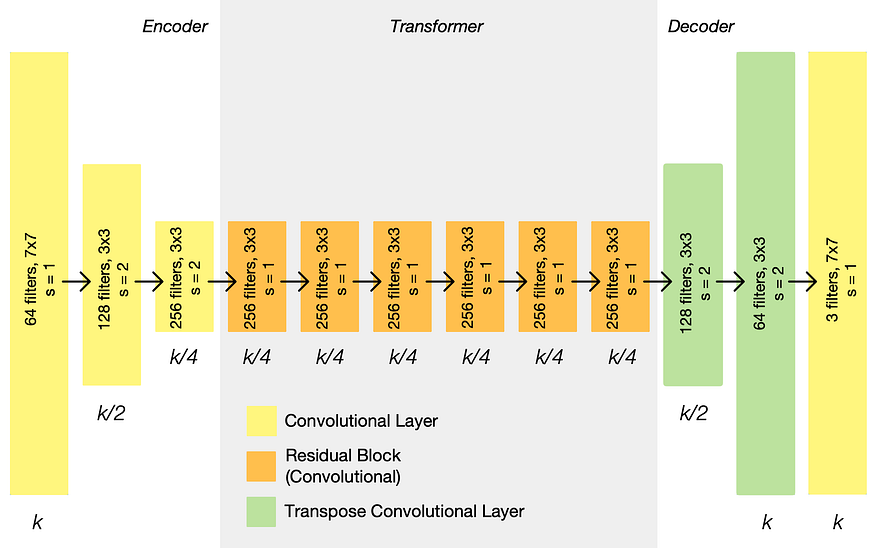

The diagram above illustrates the generator architecture used in this implementation: encoder downsampling, residual transformer blocks, and decoder upsampling.

## Example Results

### Horse outputs

<div style="display: flex; flex-wrap: wrap; gap: 1rem; align-items: flex-start;">
  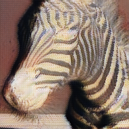
  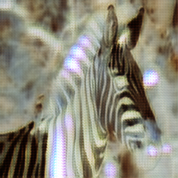
  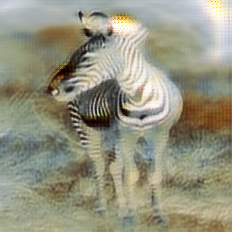
  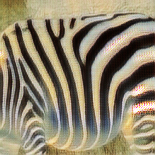
  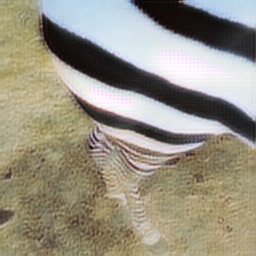
  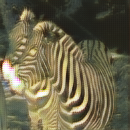
  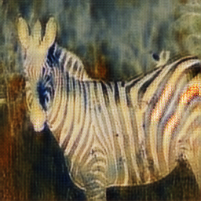
  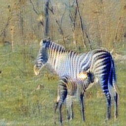
</div>

### Zebra outputs

<div style="display: flex; flex-wrap: wrap; gap: 1rem; align-items: flex-start;">
  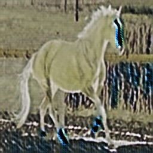
  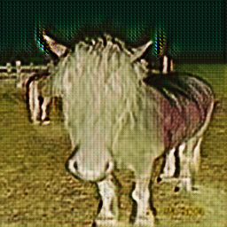
</div>

## Features

- Unpaired image translation using CycleGAN.
- ResNet generator with residual blocks.
- PatchGAN discriminator.
- Cycle-consistency plus identity loss.
- Mixed precision training using `torch.amp`.
- Checkpoint save/load support.

## Requirements

Install the required packages before training.

```bash
pip install torch torchvision albumentations tqdm pillow numpy
```

If you are using a virtual environment, activate it first.

## Dataset Structure

The project expects the following dataset layout:

```text
data/
  trainA/       # images for domain A (horse)
  trainB/       # images for domain B (zebra)
  val/
    testA/      # validation images from domain A
    testB/      # validation images from domain B
```

The dataset loader pairs images from each domain by index, allowing unpaired training via random cycling.

## Training

Run training from the repository root:

```bash
python src/train.py
```

The default configuration uses:

- `BATCH_SIZE = 1`
- `LEARNING_RATE = 2e-4`
- `NUM_EPOCHS = 10`
- `NUM_WORKERS = 4`
- `LAMBDA_CYCLE = 10`
- `LAMBDA_IDENTITY = 0.5`

Training saves sample generated images during training to an absolute path hard-coded in `src/train.py`:

- `D:/cycleGAN/saved_images/horse_{idx}.png`
- `D:/cycleGAN/saved_images/zebra_{idx}.png`

> Note: If you move this repository or run it on another machine, update the image save paths in `src/train.py`.

## Checkpoints

The script checks `config.LOAD_MODEL` to optionally load existing checkpoints and `config.SAVE_MODEL` to save checkpoints each epoch.

Default checkpoint files:

- `genh.pth.tar`
- `genz.pth.tar`
- `critich.pth.tar`
- `criticz.pth.tar`

## Notes

- `src/config.py` uses Albumentations for resizing, horizontal flipping, normalization, and tensor conversion.
- The generator outputs images with `tanh`, so inputs are normalized to `[-1, 1]`.
- Validation data is prepared in `src/train.py`, but validation loop is not implemented in this version.


